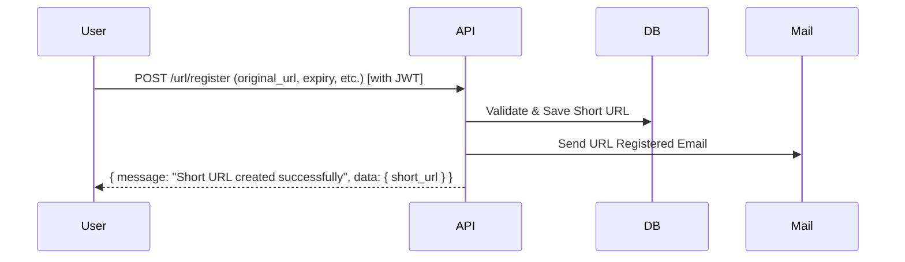

```mermaid
sequenceDiagram
    participant User
    participant API
    participant DB
    participant Mail

    User->>API: POST /url/register (original_url, expiry, etc.) [with JWT]
    API->>DB: Validate & Save Short URL
    API->>Mail: Send URL Registered Email
    API-->>User: { message: "Short URL created successfully", data: { short_url } }
```