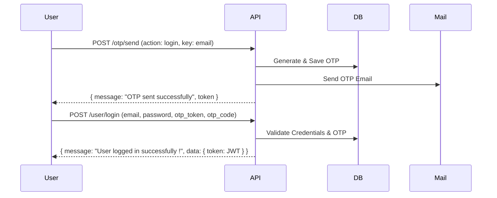

```mermaid
sequenceDiagram
    participant User
    participant API
    participant DB
    participant Mail

    User->>API: POST /otp/send (action: login, key: email)
    API->>DB: Generate & Save OTP
    API->>Mail: Send OTP Email
    API-->>User: { message: "OTP sent successfully", token }

    User->>API: POST /user/login (email, password, otp_token, otp_code)
    API->>DB: Validate Credentials & OTP
    API-->>User: { message: "User logged in successfully !", data: { token: JWT } }
```