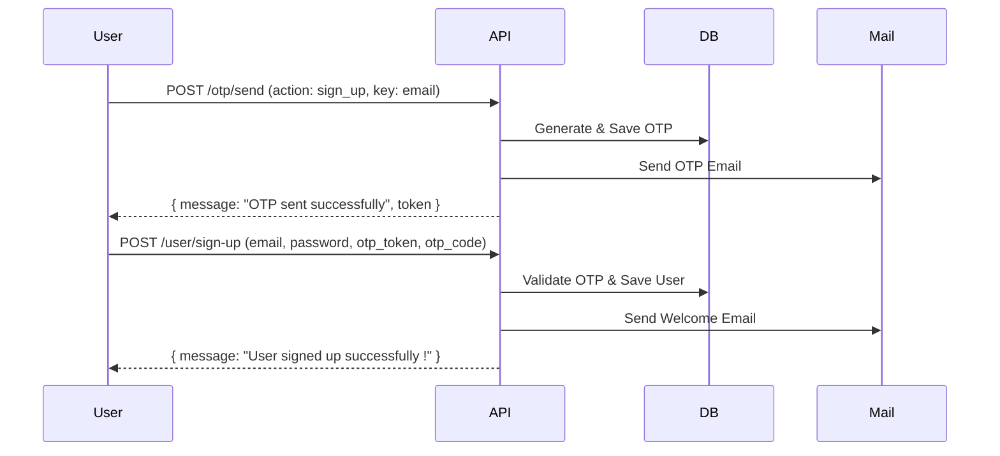

```mermaid
sequenceDiagram
    participant User
    participant API
    participant DB
    participant Mail

    User->>API: POST /otp/send (action: sign_up, key: email)
    API->>DB: Generate & Save OTP
    API->>Mail: Send OTP Email
    API-->>User: { message: "OTP sent successfully", token }

    User->>API: POST /user/sign-up (email, password, otp_token, otp_code)
    API->>DB: Validate OTP & Save User
    API->>Mail: Send Welcome Email
    API-->>User: { message: "User signed up successfully !" }
```